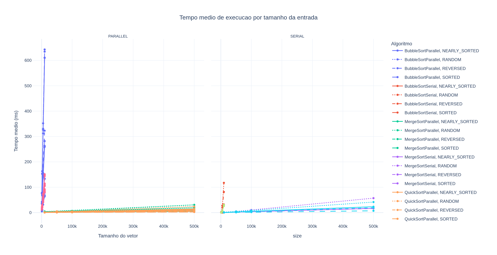
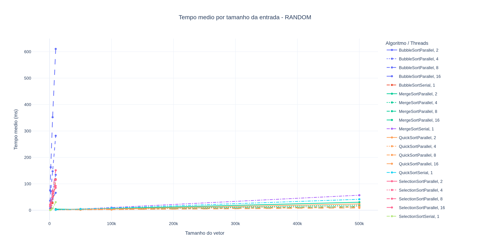
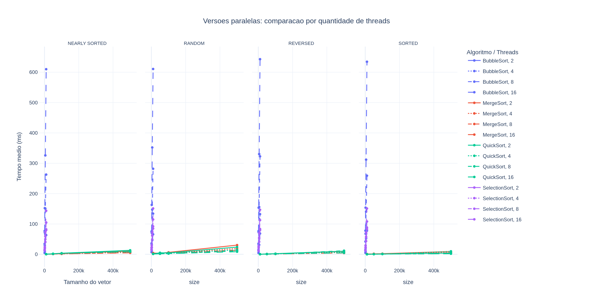
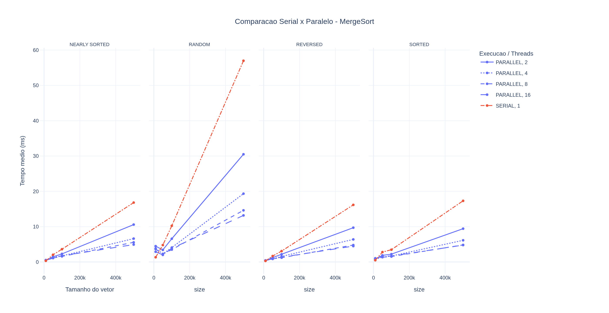
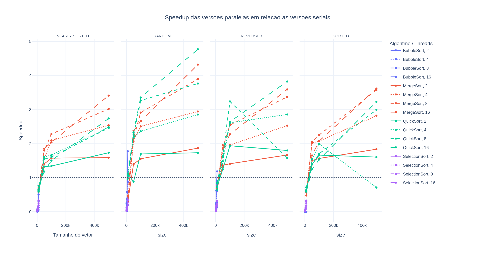
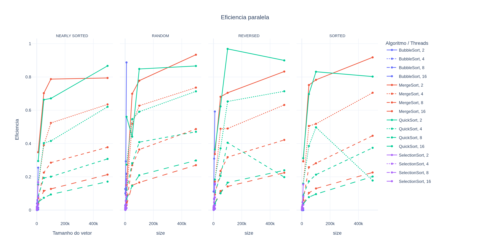

# ANÁLISE COMPARATIVA DE ALGORITMOS DE ORDENAÇÃO SERIAIS E PARALELOS EM JAVA

Autor: Janylson Filho - 2320300 ; Ulisses Magalhães - 2320436

**Palavras-chave:** ordenação paralela. concorrência. Java. benchmark. desempenho.

## Resumo

&emsp;Este trabalho apresenta uma análise comparativa entre implementações seriais e paralelas de quatro algoritmos de ordenação em Java: Bubble Sort, Selection Sort, Merge Sort e Quick Sort. O objetivo foi medir o impacto do paralelismo sobre o tempo de execução considerando diferentes tamanhos de entrada, diferentes distribuições de dados e diferentes quantidades de threads. Para isso, foi desenvolvido um benchmark que gera vetores nos cenários `RANDOM`, `SORTED`, `REVERSED` e `NEARLY_SORTED`, executa cinco amostras por configuração e registra os resultados em arquivos CSV. A análise dos resultados mostra que algoritmos quadráticos, como Bubble Sort e Selection Sort, tendem a apresentar pouco ganho ou até perda de desempenho com paralelização, devido ao alto custo de sincronização e às dependências entre etapas. Em contrapartida, Merge Sort e Quick Sort apresentaram melhor escalabilidade em entradas maiores, com speedup mais consistente nas versões paralelas.

## Introdução

&emsp;A ordenação de dados é uma operação fundamental em computação e aparece como etapa intermediária ou final em diversos sistemas. Em aplicações com grandes volumes de dados, o custo da ordenação pode impactar diretamente o desempenho global do software. Nesse contexto, o uso de paralelismo surge como alternativa para explorar melhor os processadores modernos, reduzindo o tempo de execução por meio da divisão do trabalho entre múltiplas threads.

&emsp;Apesar disso, nem todo algoritmo se beneficia da paralelização da mesma maneira. Algoritmos com forte dependência sequencial ou grande custo de coordenação entre threads podem apresentar desempenho inferior ao da versão serial. Por outro lado, algoritmos baseados em divisão e conquista costumam ser mais adequados a esse modelo de execução.

&emsp;Este projeto foi desenvolvido para comparar, de forma prática, o comportamento de algoritmos seriais e paralelos em Java. A proposta foi medir os efeitos da paralelização em diferentes tipos de entrada, diferentes tamanhos de vetor e diferentes quantidades de threads, permitindo observar em quais cenários o paralelismo realmente compensa.

## Metodologia

&emsp;O projeto foi implementado em Java e organizado em torno de um executor de benchmark responsável por gerar entradas, disparar os algoritmos e registrar as medições. Foram analisados quatro algoritmos base:

- Bubble Sort
- Selection Sort
- Merge Sort
- Quick Sort

&emsp;Cada algoritmo possui uma versão serial e uma versão paralela. As implementações paralelas seguem abordagens compatíveis com a natureza de cada algoritmo:

- `BubbleSortParallel`: adaptação baseada em Odd-Even Transposition Sort;
- `SelectionSortParallel`: paralelização da busca do menor elemento;
- `MergeSortParallel`: uso de `ForkJoinPool`;
- `QuickSortParallel`: uso de `ForkJoinPool`.

&emsp;Os testes foram realizados com cinco amostras por configuração. Os tipos de entrada gerados foram:

- `RANDOM`
- `SORTED`
- `REVERSED`
- `NEARLY_SORTED`

&emsp;Os tamanhos de entrada foram separados conforme a complexidade esperada dos algoritmos:

- algoritmos quadráticos: `1000`, `2000`, `5000`, `10000`;
- algoritmos `O(n log n)`: `10000`, `50000`, `100000`, `500000`.

&emsp;O programa detecta automaticamente a quantidade de processadores disponíveis e escolhe as opções de threads a partir disso. Na execução utilizada nesta análise, foram detectados `16` processadores, resultando no conjunto de threads `2`, `4`, `8` e `16`.

&emsp;Ao final da execução, os resultados são gravados em `parallel-sorting-java/out/resultados_ordenacao.csv`, contendo informações como algoritmo, tipo de execução, número de threads, tamanho da entrada, tipo de dado, amostra e tempo medido. A partir desse arquivo, o notebook `parallel-sorting-java/analise_graficos_dinamicos.ipynb` gera os gráficos e também produz os arquivos `resumo_estatistico.csv` e `speedup_eficiencia.csv`.

## Resultados e Discussão

&emsp;Os resultados confirmam que o paralelismo não deve ser tratado como ganho automático de desempenho. O comportamento observado depende da complexidade do algoritmo, do tamanho da entrada e do custo de coordenação entre threads.

### Tempo médio por tamanho da entrada



&emsp;No panorama geral, Bubble Sort e Selection Sort apresentaram tempos muito superiores aos demais algoritmos, especialmente quando o tamanho da entrada cresce. Isso era esperado, pois ambos possuem complexidade quadrática. Merge Sort e Quick Sort mantiveram tempos menores e crescimento mais controlado, tornando-se mais adequados para entradas maiores.

### Tempo médio para entrada aleatória



&emsp;Na entrada `RANDOM`, o comportamento fica mais evidente. As versões paralelas de Bubble Sort e Selection Sort não mostraram ganho consistente e, em vários casos, ficaram mais lentas do que a versão serial. O custo de sincronização, divisão do trabalho e coordenação entre threads superou qualquer benefício prático de paralelização nesses algoritmos.

### Comparação das versões paralelas por número de threads



&emsp;As curvas mostram que aumentar a quantidade de threads nem sempre melhora o desempenho. Para algoritmos menos adequados ao paralelismo, mais threads apenas aumentam overhead. Já em Merge Sort e Quick Sort, principalmente nas maiores entradas, há melhor aproveitamento dos recursos de hardware, embora o ganho não cresça indefinidamente.

### Comparação serial x paralelo para Merge Sort



&emsp;O Merge Sort foi um dos algoritmos que melhor respondeu ao paralelismo. Como sua estrutura é naturalmente divisível em subproblemas independentes, o uso de `ForkJoinPool` permitiu distribuir melhor a carga entre threads. Esse comportamento reforça que algoritmos baseados em divisão e conquista tendem a ser mais apropriados para execução paralela.

### Speedup



&emsp;O gráfico de speedup mostra que os melhores ganhos aparecem, de forma geral, nos algoritmos `MergeSort` e `QuickSort`, sobretudo em tamanhos maiores. Para Bubble Sort e Selection Sort, o speedup frequentemente fica próximo de `1` ou abaixo disso, indicando que a versão paralela não compensou em vários cenários.

### Eficiência paralela



&emsp;A eficiência paralela também confirma essa diferença. Mesmo quando há speedup, o aproveitamento das threads tende a cair à medida que o número de threads aumenta, o que evidencia limitações práticas de escalabilidade. Em especial, algoritmos quadráticos apresentaram baixa eficiência, enquanto Merge Sort e Quick Sort aproveitaram melhor os recursos disponíveis, ainda que sem escalabilidade perfeita.

&emsp;De forma geral, os resultados mostram que a escolha do algoritmo influencia mais no desempenho do que apenas aumentar o paralelismo. A paralelização é vantajosa quando combinada com algoritmos cuja estrutura favorece a decomposição do problema e reduz o custo de sincronização.

## Conclusão

&emsp;O estudo mostrou que a paralelização em Java pode trazer ganhos relevantes, mas esses ganhos dependem diretamente do algoritmo utilizado. Bubble Sort e Selection Sort, por possuírem estrutura mais sequencial e custo elevado de coordenação, não se mostraram boas opções para paralelização. Em vários cenários, suas versões paralelas foram mais lentas do que as seriais.

&emsp;Por outro lado, Merge Sort e Quick Sort apresentaram melhor comportamento, principalmente em entradas maiores. A estratégia de divisão e conquista, aliada ao uso de `ForkJoinPool`, favoreceu o uso eficiente de múltiplas threads e produziu melhores resultados de speedup e eficiência.

&emsp;Assim, conclui-se que o paralelismo não substitui a escolha correta do algoritmo. Em problemas de ordenação, algoritmos mais adequados ao modelo paralelo tendem a produzir ganhos reais, enquanto algoritmos com forte dependência sequencial podem apenas aumentar o custo da execução.

## Referências

CORMEN, Thomas H.; LEISERSON, Charles E.; RIVEST, Ronald L.; STEIN, Clifford. *Algoritmos: teoria e prática*. Rio de Janeiro: Elsevier, 2012.

GOETZ, Brian et al. *Java Concurrency in Practice*. Boston: Addison-Wesley, 2006.

ORACLE. *Class ForkJoinPool*. Disponível em: <https://docs.oracle.com/en/java/>. Acesso em: 6 maio 2026.

PLOTLY. *Python Graphing Library*. Disponível em: <https://plotly.com/python/>. Acesso em: 6 maio 2026.

## Como Executar

Fluxo principal:

```bash
cd parallel-sorting-java
javac -d out src/*.java
java -cp out Main
source .venv/bin/activate
jupyter notebook
```

&emsp;Abra `analise_graficos_dinamicos.ipynb` e execute as células. Os gráficos serão gerados em `images/` e os arquivos de saída em `out/`.

### Caso o Jupyter não funcione no IntelliJ

&emsp;Se o IntelliJ não conseguir abrir ou executar o notebook, rode o Jupyter diretamente pelo terminal, a partir da pasta `parallel-sorting-java`.

Crie o ambiente virtual:

```bash
python3 -m venv .venv
```

Ative o ambiente:

```bash
source .venv/bin/activate
```

Instale as dependências:

```bash
pip install notebook pandas plotly ipywidgets nbformat kaleido
```

Abra o Jupyter:

```bash
jupyter notebook
```

&emsp;Se o navegador não abrir automaticamente, copie o link exibido no terminal e cole no navegador. Depois, abra `analise_graficos_dinamicos.ipynb` e execute as células. Esse foi o fluxo usado para rodar o notebook fora do IntelliJ.
